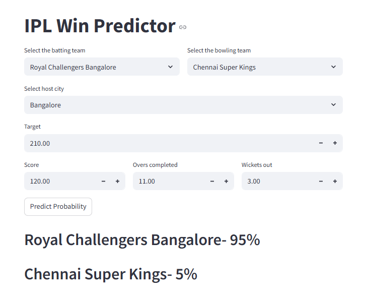

# 🏏 IPL Win Probability Predictor

This is a simple Streamlit web application that predicts the winning probability of an IPL team during a live match, based on current match conditions.

## 🔮 Features

- Select **Batting** and **Bowling** teams
- Enter **match conditions**: runs, wickets, overs, target score, etc.
- Displays the **real-time win probability** for each team using a trained machine learning model
- Gives visual feedback using progress bars and probability percentages

## 🚀 Live Demo


## 🖥️ Screenshots



## 🛠️ Tech Stack

- **Frontend**: [Streamlit](https://streamlit.io/)
- **Backend / Model**: Scikit-learn
- **Language**: Python
- **Model Type**: Trained on past IPL match data using classification algorithms (e.g. Logistic Regression, Random Forest)

## 📦 Installation

1. **Clone the repo**

```bash
git clone https://github.com/bharthdev-05/ipl-win-predictor.git
cd ipl-win-predictor
```

2. **Create virtual environment (optional but recommended)**

```bash
python -m venv venv
# On Unix or MacOS
source venv/bin/activate
# On Windows
venv\Scripts\activate
```

3. **Install dependencies**

```bash
pip install -r requirements.txt
```

4. **Run the app**

```bash
streamlit run app.py
```

## 📊 How It Works

The app takes match context as input (runs, overs, wickets, etc.) and uses a pre-trained machine learning model to predict the win probability. It is trained on historical IPL match data with features engineered to represent real-time match momentum.

## 🧠 Future Improvements

- Add match visualization charts (run rate comparison, momentum graph)
- Deploy using Streamlit Cloud / AWS / Heroku
- Live data integration via API
- Add T20 leagues from other countries

## 🙌 Acknowledgements

- [Kaggle IPL datasets](https://www.kaggle.com/datasets)
- [Streamlit Docs](https://docs.streamlit.io/)
- Scikit-learn & Pandas

## 📬 Contact

For questions, suggestions, or feedback, feel free to reach out at [bharathsde05@gmail.com] or raise an issue.

---

⭐ If you like this project, give it a star and consider contributing!


